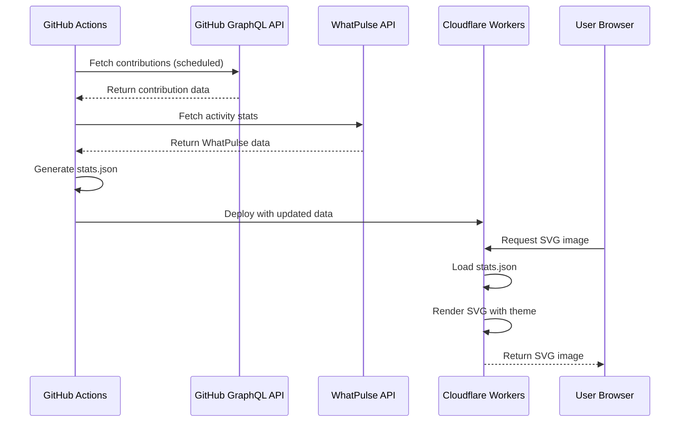

The GitHub profile README generator is a serverless application built on Cloudflare Workers that dynamically generates SVG graphics displaying contribution history and activity statistics.

## System Components

The architecture consists of three main components:

### 1. GitHub Actions (Data Collection)

A scheduled workflow fetches contribution data from GitHub's GraphQL API and WhatPulse statistics, storing them as JSON files that are deployed with the Worker.

**Key Script**: `scripts/stats.ts`

```typescript
// Fetches contributions for a date range (max 1 year per request)
const body = {
  query: `query ($username: String!, $from: DateTime, $to: DateTime) {
    user(login: $username) {
      contributionsCollection(from: $from, to: $to) {
        contributionCalendar {
          totalContributions
          weeks {
            contributionDays {
              contributionCount
              date
              contributionLevel
            }
          }
        }
      }
    }
  }`
}
```

### 2. Cloudflare Workers (Request Handling)

The Worker serves as an edge function that processes HTTP requests and returns dynamically generated SVG images.

**Entry Point**: `src/worker.ts`

```typescript
export default {
  async fetch(request, env, ctx) {
    const { searchParams } = new URL(request.url);
    const theme = searchParams.get("theme") ?? "light";
    const section = searchParams.get("section") ?? "";
    
    // Route to appropriate renderer
    if (section === "top") {
      content = top({ height: 20, contributions, theme });
    } else {
      content = main({ height: 310, years, sizes, length, location, theme });
    }
    
    return new Response(content, {
      headers: { "content-type": "image/svg+xml" }
    });
  }
}
```

### 3. GitHub GraphQL API

Provides contribution data including:
- Total contributions count
- Daily contribution levels (NONE, FIRST_QUARTILE, SECOND_QUARTILE, THIRD_QUARTILE, FOURTH_QUARTILE)
- Contribution dates and calendar weeks

## Data Flow



## File Structure

```
source/
├── src/
│   ├── worker.ts       # Cloudflare Worker entry point
│   ├── render.ts       # SVG rendering functions
│   ├── stats.json      # Generated contribution data
│   └── types.d.ts      # TypeScript type definitions
├── scripts/
│   └── stats.ts        # Data fetching script
└── wrangler.toml       # Cloudflare Workers configuration
```

### File Responsibilities

| File | Purpose |
|------|--------|
| `worker.ts` | Routes requests, parses query parameters, loads data, orchestrates rendering |
| `render.ts` | Contains all SVG generation logic, styles, and HTML templates |
| `stats.ts` | Fetches and transforms data from GitHub and WhatPulse APIs |
| `stats.json` | Static snapshot of contribution data (regenerated on deploy) |

## Request Lifecycle

1. **Request Received**: Worker receives HTTP request at edge location
2. **Parameter Parsing**: Extract `theme` (light/dark) and `section` (top/main/link/fallback)
3. **Data Loading**: Import pre-generated `stats.json` containing contribution history
4. **Location Detection**: Extract visitor location from Cloudflare request object
5. **Layout Calculation**: Compute SVG dimensions based on data and responsive breakpoints
6. **Rendering**: Generate SVG with CSS-in-JS styles and HTML content
7. **Response**: Return SVG with appropriate headers and cache directives

```typescript
// Example: Main graph rendering
const years = data.years.slice(0, MAX_YEARS);
const location = {
  city: (request.cf?.city || "") as string,
  country: (request.cf?.country || "") as string,
};

const sizes = years.map((year) => {
  const columns = Math.ceil(year.days.length / options.dots.rows);
  const width = columns * options.dots.size + (columns - 1) * options.dots.gap;
  const height = options.dots.rows * options.dots.size + (options.dots.rows - 1) * options.dots.gap;
  return [width, height];
});
```

## Configuration

The system uses query parameters for runtime configuration:

- `?theme=light|dark` - Color scheme selection
- `?section=top|link-*|fallback` - Component selection
- `?i=<number>` - Animation index for link components

<Info>
The Worker uses `no-cache` headers to ensure GitHub always displays the latest version, even though the underlying data only updates when deployed.
</Info>

## Deployment Strategy

The application follows a two-phase deployment:

1. **Build Phase**: Run `pnpm stats` to fetch latest data
2. **Deploy Phase**: Bundle Worker code and stats.json to Cloudflare's edge network

```bash
pnpm deploy  # Runs: pnpm stats && wrangler deploy
```

<Warning>
Since data is bundled at deploy time, contribution counts only update when you redeploy. Consider setting up GitHub Actions to automatically deploy on a schedule.
</Warning>